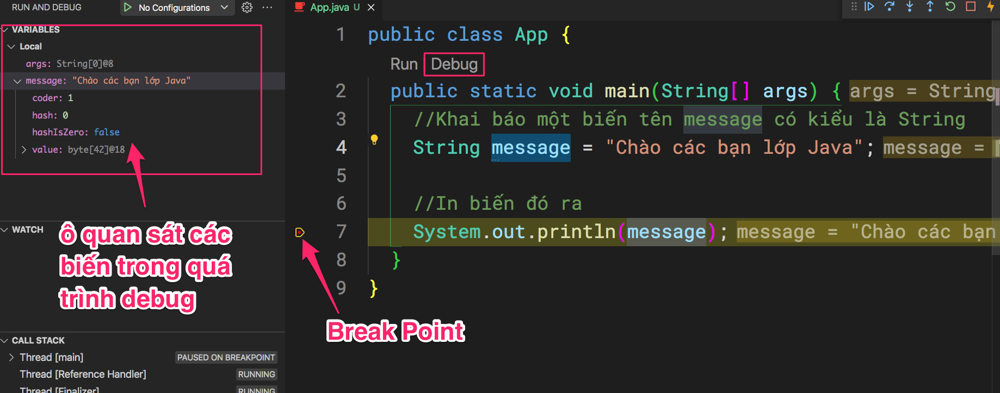
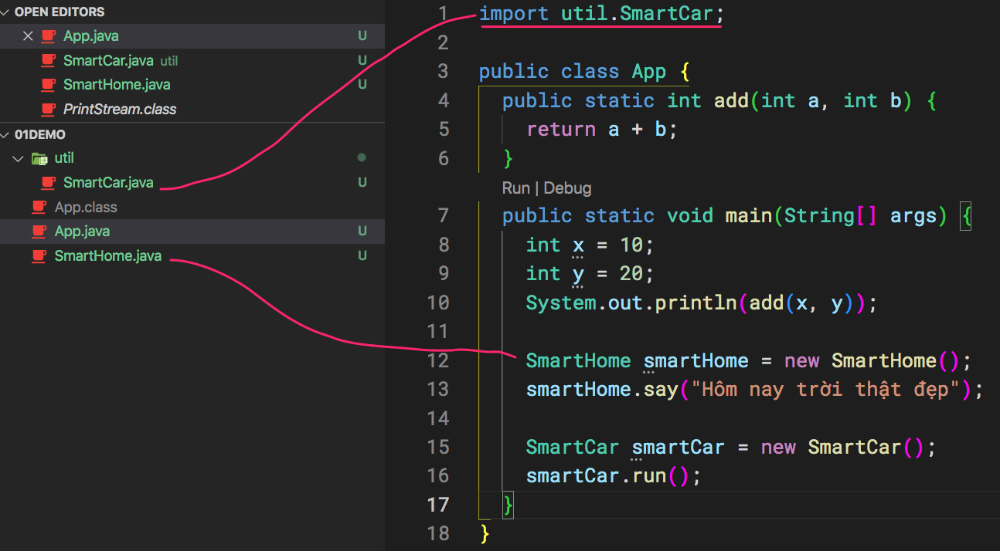

Cài đặt SDKMan ở https://sdkman.io/

Java cần Java Virtual Machine (JVM) để chạy. Để có JVM thì cần phải JDK (Java Development Kit). Người dùng bình thường chỉ cần cài đặt Java Run Time. Còn lập trình viên cần phải cài JDK.

JDK có nhiều phiên bản: 8,9,10,11,12,13,14,15,16,17

Cần công cụ giúp việc cài đặt nhiều JDK version khác nhau dễ dàng.

Trường hợp cài đặt SDKMan quá phức tạp, chúng ta thống nhất sử dụng Java JDK phiên bản 16
https://www.oracle.com/java/technologies/javase-jdk16-downloads.html


Gõ lệnh để kiểm tra phiên bản
```java --version```

```javac --version```

Gõ lệnh để kiểm tra biến môi trường
```echo $JAVA_HOME```

Biến môi trường $JAVA_HOME trỏ đến thư mục cài đặt JDK. Trong thư mục này có những folder
```
.
├── bin <-- chứa lệnh java và javac
├── conf
├── include
├── jmods
├── legal
├── lib <-- chứa các thư viện khác
└── release
```
Cài đặt Java Extension Pack

Cài bổ xung Tabnine Autocomplete AI

Có vài cách để biên dịch ứng dụng Java:

1- Cách dễ nhất sử dụng IDE là VSCode hoặc Intellij
2- Dùng lệnh javac
3- Dùng lệnh make

Cần phải cd (change directory) đến thư mục chứa file App.java sau đó mới dùng lệnh javac

javac App.java
Xuất ra file App.class






