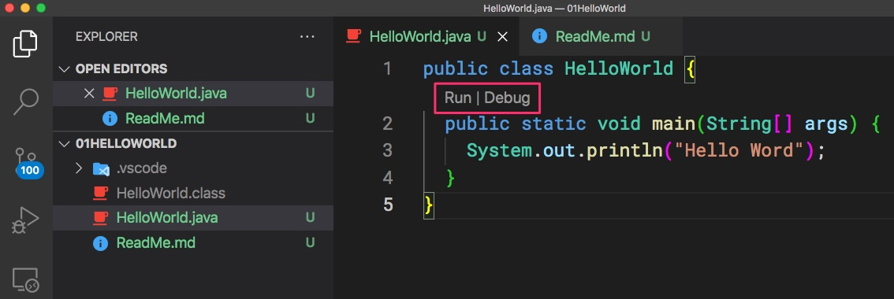
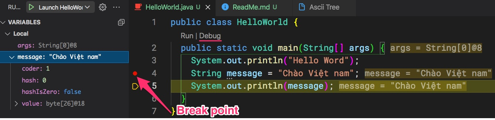

# Viết ứng dụng HelloWorld

# 1. Tạo file và biên dịch bằng javac
```java
public class HelloWorld {
  public static void main(String[] args) {
    System.out.println("Hello Word");
  }  
}
```


Rồi trong thư mục chứa file HelloWorld.java. Chú ý ```$``` là dấu nhắc terminal, bạn không cần phải gõ
```
$ javac HelloWorld.java
$ java HelloWorld
Hello World
```

Lệnh ```javac HelloWorld.java``` sẽ tạo ra file HelloWorld.class
```
.
├── HelloWorld.class <-- Mã byte code
└── HelloWorld.java <-- Mã nguồn đọc được, sửa được
```

# 2. Biên dịch bằng Visual Studio Code


Run khác Debug ở điểm nào?
- Lệnh Run sẽ thực thi ứng dụng
- Lệnh Debug bên cạnh thực thi còn cho phép dừng lại ở một số dòng (break point) để lập trình viên xem xét, gỡ rối, sửa lỗi.

