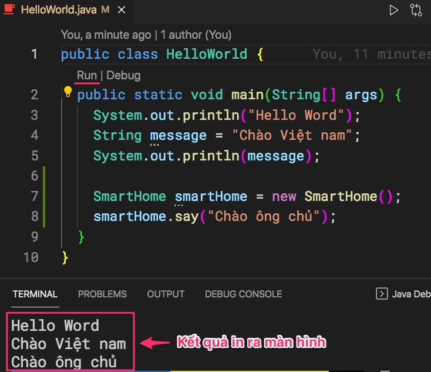

# Viết ứng dụng HelloWorld

# 1. Tạo file và biên dịch bằng javac
```java
public class HelloWorld {
  public static void main(String[] args) {
    System.out.println("Hello Word");
  }  
}
```


Rồi trong thư mục chứa file HelloWorld.java. Chú ý ```$``` là dấu nhắc terminal, bạn không cần phải gõ
```
$ javac HelloWorld.java
$ java HelloWorld
Hello World
```

Lệnh ```javac HelloWorld.java``` sẽ tạo ra file HelloWorld.class
```
.
├── HelloWorld.class <-- Mã byte code
└── HelloWorld.java <-- Mã nguồn đọc được, sửa được
```

# 2. Biên dịch bằng Visual Studio Code


Run khác Debug ở điểm nào?
- Lệnh Run sẽ thực thi ứng dụng
- Lệnh Debug bên cạnh thực thi còn cho phép dừng lại ở một số dòng (break point) để lập trình viên xem xét, gỡ rối, sửa lỗi.


Hãy thử bổ xung 2 dòng lệnh này, rồi chạy debug để xem giá trị của biến message
```java
String message = "Chào Việt nam";
System.out.println(message);
```


# 3. Tạo thêm một file SmartHome.java mới

```
.
├── HelloWorld.class
├── HelloWorld.java
└── SmartHome.java  <-- file mới
```
```java
public class SmartHome {
  public void say(String message) {
    System.out.println(message);
  }
}
```

Sửa file HelloWorld.java
```java
public class HelloWorld {
  public static void main(String[] args) {
    System.out.println("Hello Word");
    String message = "Chào Việt nam";
    System.out.println(message);

    SmartHome smartHome = new SmartHome();
    smartHome.say("Chào ông chủ");
  }  
}
```



Nếu sử dụng trình biên dịch javac, chúng ta cần gõ như sau
```
$ javac HelloWorld.java
$ java HelloWorld
Hello Word
Chào Việt nam
Chào ông chủ
```
File SmartHome.java cũng được biên dịch sang SmartHome.class trong lệnh ```javac HelloWorld.java```

```
.
├── HelloWorld.class
├── HelloWorld.java
├── SmartHome.class
└── SmartHome.java
```

# 4. Câu hỏi ôn tập

1. Lệnh ```java``` khác gì với ```javac```?
2. Ý nghĩa của từ khoá ```public```?
3. Ý nghĩa của từ khoá ```class```?
4. Quy ước đặt tên cho Java class là gì?
5. File có đuôi java khác gì file có đuôi class?
6. Từ khoá ```void``` có ý nghĩa gì?
7. Hãy giải thích lệnh này
  ```java
  SmartHome smartHome = new SmartHome();
  ```